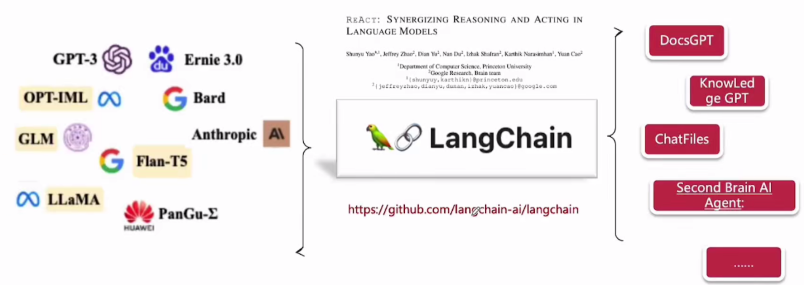
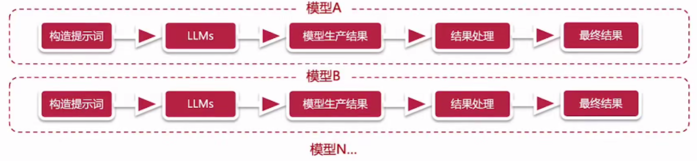
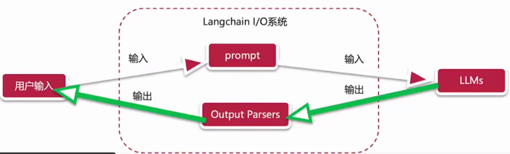

### 初识LangChain

LangChain是一个开源框架，旨在简化使用大语言模型构建端到端应用程序的过程，它是ReAct(reason + act)论文的落地实现。

1. 是解决大模型各种问题的提示词工程方案之一
2. 提供了与LLMs交互的各种组件，极大提升了开发工具
3. 可以以文件方式加载提示词、链等，方便共享提示词和做提示词版本管理
4. 提供了丰富的链式工具箱

### 能力一览

|     能力      |                             解释                             |
| :-----------: | :----------------------------------------------------------: |
| LLMs & Prompt | 提供了目前市面上几乎所有的LLM的通用接口，同时还提供了提示词的管理和优化能力，同时也提供了非常多的相关工具，以方便开发人员利用LangChain与LLMs进行交互 |
|    Chains     | LangChain把提示词、大语言模型、结果解析封装成Chain，并提供标准的接口，以便允许不同的LangChain形成交互序列，为AI原生应用提供了端到端Chain |
|      RAG      | 检索增强生成式是一种解决预训练语料数据无法及时更新而带来的回答内容陈旧的方式。 LangChain提供了支持检索增强生成式的Chain，在使用时，这些Chain会首先与外部数据源进行交互以获得对应数据，然后再利用获得的数据与LLMs进行交互。典型的应用场景如：基于特定数据源的问答机器人 |
|     Agent     | 对于一个任务，代理主要涉及让LLMs来对任务进行拆分、执行该行动、并观察执行结果，代理会重复执行这个过程，直到该任务完成为止 LangChain为代理提供了标准接口，可供选择的代理，以及一些端到端的代理的示例 |
|    Memory     | 指的是chain或agent调用之间的状态持久化。Langchain为内存提供了标准接口，并提供了一系列的内存实现。 |
|  Evaluation   | Langchain还提供了非常多的评估能力以允许我们可以更方便的对LLMS进行评估 |

### 优势与劣势

- 优势
  - 大语言模型调用能力，支持多平台多模型调用，为用户提供灵活选择
  - 轻量级SDK(Python、Javascrip)将LLMs与传统编程语言集成在一起
  - 多模态支持，提供多模态数据支持，如图像、音频等
- 劣势
  - 学习曲线相对较高
  - 文档相对不完善
  - 缺乏工业化应用

### 

