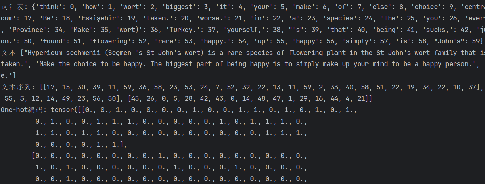
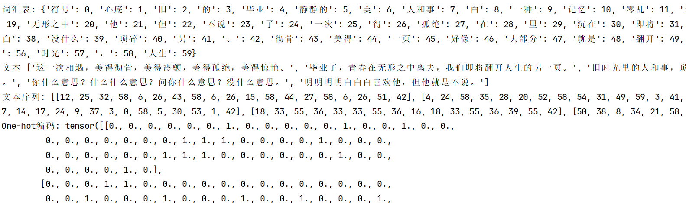

## One-hot编码

One-Hot编码，又称为一位有效编码，主要是采用N位状态寄存器来对**N** **个状态**进行编码，每个状态都由他独立的寄存器位，并且在任意时候只有一位有效。

#### 基本原理

假设我们有一个分类变量，其取值为["红色", "绿色", "蓝色"]，我们希望将这些值进行One-hot编码。其过程如下：

1. **确定类别数**：首先，确定所有可能的类别。对于这个例子，我们有三个类别：红色、绿色和蓝色。
2. **创建二进制向量**：为每个类别创建一个二进制向量。向量的长度等于类别的总数，每个类别对应的向量中只有一个位置为1，其余位置为0。
3. **yi编码每个类别**：将每个类别映射到其对应的二进制向量。

| 类别 | One-hot 编码 |
| ---- | ------------ |
| 红色 | [1, 0, 0]    |
| 绿色 | [0, 1, 0]    |
| 蓝色 | [0, 0, 1]    |

如果有一个包含这些类别的数组，例如`["红色", "蓝色", "绿色"]`，经过One-hot编码后，它们会转换为：

`[[0, 0, 1], [0, 1, 0],[1,0,0]]`。

#### 优缺点

- **避免顺序关系问题**：在某些机器学习算法中，直接使用整数编码的分类变量可能会引入错误的顺序关系。例如，如果用0代表“红色”，1代表“绿色”，2代表“蓝色”，模型可能会误以为绿色比红色大，而蓝色比绿色大。One-hot编码消除了这种误解。
- **其问题在于很难做相似度计算**：它假设词和词之间相互独立，但在大部分情况下，词和词之间是相互影响的；另外在大规模语料上，One-hot的编码长度可能为几十万、几百万甚至更大，此时，One-hot编码显然不合适。

### 编码案例

#### 英文案例

```python
import jieba
import torch

# 英文示例文本
texts = ['Hypericum sechmenii (Seçmen \'s St John\'s wort) is a rare species of flowering plant in the St John\'s wort family that is found in Eskişehir Province in central Turkey.',
         'Be yourself, everyone else is already taken.',
         'Make the choice to be happy. The biggest part of being happy is to simply make up your mind to be a happy person.',
         'When you think your life sucks, just think to yourself about how many people have it worse.']

# 构建词汇表
word_index = {}
index_word = {}

for i, word in enumerate(set(" ".join(texts).split())):
    word_index[word] = i
    index_word[i] = word

# 将文本转化为整数序列
sequences = [[word_index[word] for word in text.split()] for text in texts]

# 获取词汇表的大小
vocab_size = len(word_index)

# 将整数序列编码为One-hot编码
one_hot = torch.zeros((len(texts), vocab_size), dtype=torch.float)
for i, seq in enumerate(sequences):
    one_hot[i, seq] = 1

# 打印结果
print("词汇表:", word_index)
print("文本", texts)
print("文本序列:", sequences)
print("One-hot编码:", one_hot)

```



#### 中文案例

```python
# 中文示例文本
texts = ["这一次相遇，美得彻骨，美得震颤，美得孤绝，美得惊艳。",
         "毕业了，青春在无形之中离去，我们即将翻开人生的另一页。",
         "旧时光里的人和事，琐碎而零乱。我的记忆很模糊，好像大部分都成了一种温馨的符号，静静的沉在我心底。",
         "你什么意思？什么什么意思？问你什么意思？没什么意思。",
         "明明明明白白白喜欢他，但他就是不说。"]


tokenized_texts = [list(jieba.cut(text, cut_all=False)) for text in texts]

word_index = {}
index_word = {}
for i, word in enumerate(set([word for text in tokenized_texts for word in text])):
    word_index[word] = i
    index_word[i] = word

# 将文本装化成整数序列
sequences = [[word_index[word] for word in text] for text in tokenized_texts]

# 获取词汇表的大小
vocab_size = len(word_index)
one_hot = torch.zeros((len(texts), vocab_size), dtype=torch.float)

# 将整数序列转换为One-hot编码
for i, seq in enumerate(sequences):
    one_hot[i, seq] = 1

# 打印结果
print("词汇表:", word_index)
print("文本", texts)
print("文本序列:", sequences)
print("One-hot编码:", one_hot)
```

