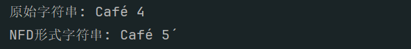

### 文本处理

#### 将字符串转换为Unicode规范形式

NFD形式将所有的组合字符分解成基本字符加上组合附加符，示例如下

```python
import unicodedata

def to_nfd(s):
    return unicodedata.normalize('NFD', s)

# 示例字符串
s = 'Café'
nfd_s = to_nfd(s)

print("原始字符串:", s, len(s))
print("NFD形式字符串:", nfd_s, len(nfd_s))
```



