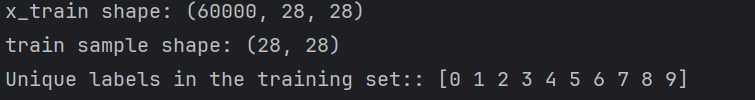
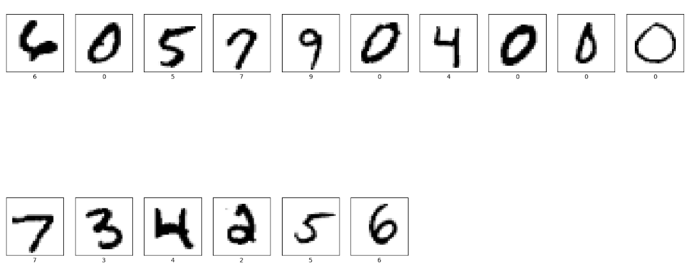
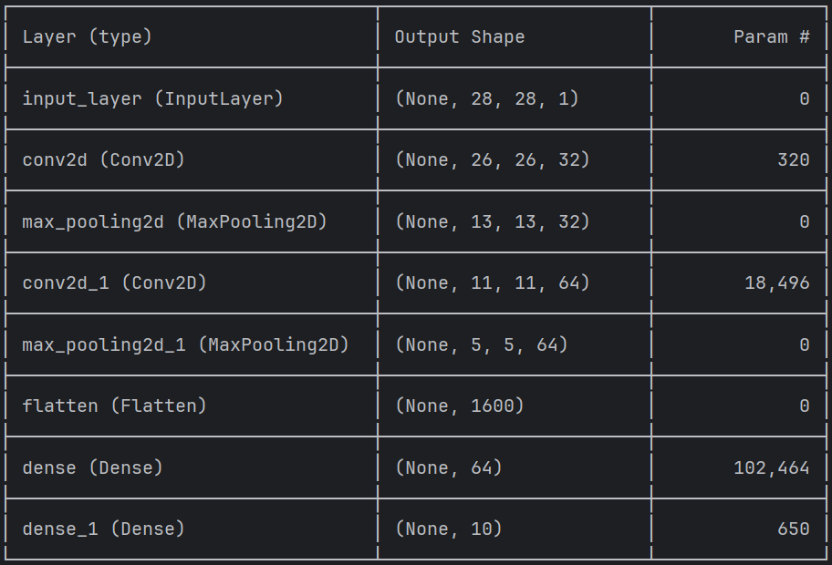
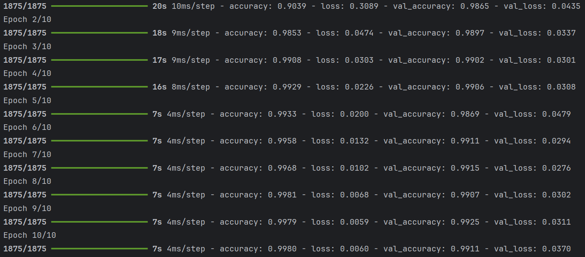
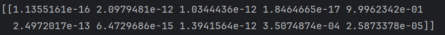
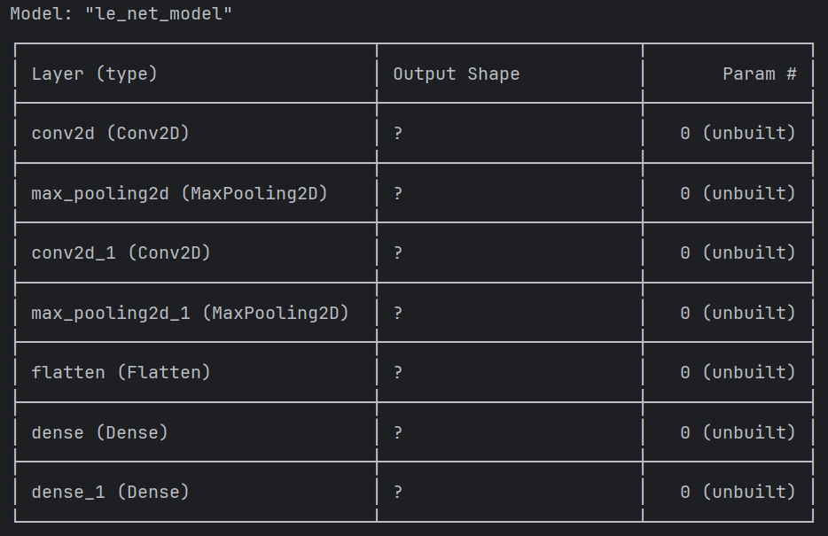

## 实现mnist手写数字识别

### 问题定义

本文实现的是手写数字识别，我们知道数字共有10个`0、1、2、……、9`，那么这个问题本质上是一个10分类问题。

### 数据准备

```python
import tensorflow as tf
import numpy as np
import matplotlib.pyplot as plt

def loader_data():
    # 直接从网络下载数据集
    (x_train, y_train), (x_test, y_test) = tf.keras.datasets.mnist.load_data()
    # 归一化处理, 将像素的值标准化0~1之间
    x_train, x_test = x_train / 255.0, x_test / 255.0
    # 查看数据的信息
    print('x_train shape:', x_train.shape)
    print('train sample:', x_train[0], )
    print('Unique labels in the training set::', np.unique(y_train))
```



#### 可视化图片

```python
def plot_mnist_images(images, labels):
    num = len(images)  # 子图的数量
    # 创建一个宽度为20英寸、高度为10英寸的图形(Figure对象)
    plt.figure(figsize=(20, 10))
    for i in range(num):
        # 将整个figure分成(num/10 + 1) 行, 10列
        plt.subplot(int(num/10) + 1, 10, i + 1)
        # 设置不显示x轴刻度
        plt.xticks([])
        # 设置不显示y轴刻度
        plt.yticks([])
        # 设置不显示子图网格线
        plt.grid(False)
        # 图像展示，cmap为颜色图谱， "plt.cm.binary"为matplotlib.cm中的色表
        plt.imshow(images[i], cmap=plt.cm.binary)
        # 设置x轴标签为图片对应的数字
        plt.xlabel(labels[i])
    # 显示图片
    plt.show()
# 生成16个随即索引
random_indices = np.random.choice(x_train.shape[0], size=16, replace=False)
plot_mnist_images(x_train[random_indices], y_train[random_indices])
```



#### 调整数据

```python
 # 调整数据到我们需要的格式，即添加一个通道的维度
    x_train = x_train.reshape(x_train.shape[0], 28, 28, 1).astype('float32')
    x_test = x_test.reshape(x_test.shape[0], 28, 28, 1).astype('float32')
    print('x_train shape:', x_train.shape)
    print('x_test shape:', x_test.shape)
# 输出 
#  x_train shape: (60000, 28, 28, 1)
#  x_test shape: (10000, 28, 28, 1)
```

### 构建CNN网络模型

```python
class LeNetModel(Model):
    def __init__(self):
        super(LeNetModel, self).__init__()
        self.conv1 = Conv2D(filters=32, kernel_size=(3, 3), input_shape=(28, 28, 1),padding='same', activation='relu')
        self.pool1 = MaxPooling2D(pool_size=(2, 2))
        self.conv2 = Conv2D(64, (3, 3), padding='same', activation='relu')
        self.pool2 = MaxPooling2D(pool_size=(2, 2))
        self.flatten = Flatten()
        self.fc = Dense(64, activation='relu')
        self.out = Dense(10, activation='softmax')

    def call(self, x):
        x = self.conv1(x)
        x = self.pool1(x)
        x = self.conv2(x)
        x = self.pool2(x)
        x = self.flatten(x)
        x = self.fc(x)
        return self.out(x)
	
    # 这个方法是因为要打印整个模型的形状
    def model(self):
        x = Input(shape=(28, 28, 1))
        return Model(inputs=[x], outputs=self.call(x))

model = LeNetModel()
model.model().summary()
```



### 编译模型

```python
"""
这里设置优化器、损失函数以及metrics,通俗地说
	优化器就是优化器是训练神经网络时用来调整模型权重的算法，每次调整的大小、方向等等
	损失函数是衡量模型预测和实际结果之间的差距的函数，优化器就是根据这个分数来调整模型的
	metrics是用来评估模型性能的标准，可以在训练和评估过程中监控，就像运动比赛中的各项数据统计（比如得分、助攻、篮板等），用来衡量模型在特定方面的表现
"""

model.compile(
        # 选择使用Adam优化器
        optimizer='adam',
        # 设置损失函数为交叉熵损失函数（tf.keras.losses.SparseCategoricalCrossentropy()）
        #from_logits为True时，会将y_pred转化为概率（用softmax），否则不进行转换，通常情况下用True结果更稳定
        loss=tf.losses.SparseCategoricalCrossentropy(from_logits=True),
        metrics=['accuracy'])
```

### 训练模型

```python
history = model.fit(
        # 训练数据
        X_train,
        # 训练数据对应的标签
        y_train,
        epochs=10,
        # 设置验证集
        validation_data=(X_test, y_test),
    )
```



### 预测

```python
plt.imshow(X_test[6])
prob = model.predict(X_test[6].reshape(1, 28, 28, 1))# 6号索引图片为每一类图片的几率，数字越大，out数字的可能性越大
print(prob)
```



### 问题解决

当我直接使用`model.summary()`输出网络结构时，Output_Shape为？，如下图所示：



具体的解决方法就是在自定义的模型类内添加一个函数：

```python
def model(self):
    x = Input(shape=(28, 28, 1))
    return Model(inputs=[x], outputs=self.call(x))
```

网上还有一种方法是在网络的第一层添加参数`input_shape=(28,28,1)`，但是这种方法无法解决问题。
