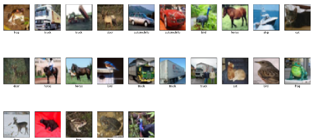
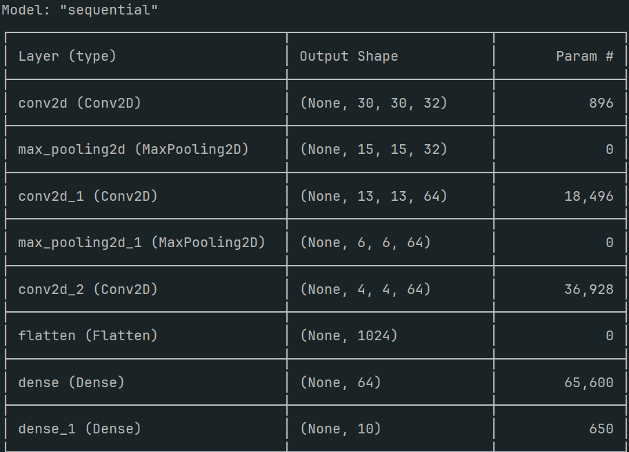
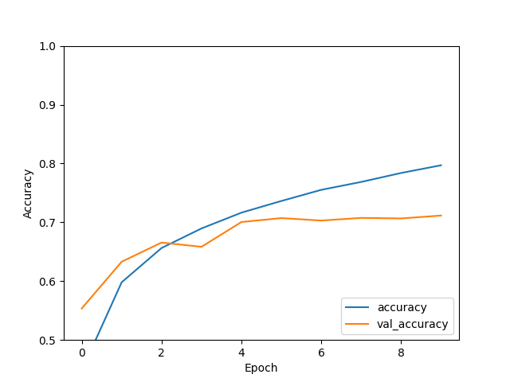

## T2彩色图片分类

>- **🍨 本文为[🔗365天深度学习训练营](https://mp.weixin.qq.com/s/0dvHCaOoFnW8SCp3JpzKxg) 中的学习记录博客**
>- **🍖 原作者：[K同学啊](https://mtyjkh.blog.csdn.net/)**

### 数据准备

```python
def load_data():
    (train_imgs, train_labels), (test_imgs, test_labels) = datasets.cifar10.load_data()
    train_imgs, test_imgs = train_imgs/255.0, test_imgs/255.0 # 归一化
    return train_imgs, train_labels, test_imgs, test_labels
train_imgs, train_labels, test_imgs, test_labels = load_data()
print("数据形状", train_imgs.shape, train_labels.shape, test_imgs.shape, test_labels.shape)
```

```
170498071/170498071 ━━━━━━━━━━━━━━━━━━━━ 25s 0us/step
(50000, 32, 32, 3) (50000, 1) (10000, 32, 32, 3) (10000, 1)
```

### 图片可视化

```python
def plot_datasets(images, labels, num : int):
    """
    画出train数据集上前num个图片
    :param num:
    :return:
    """
    class_names = ['airplane', 'automobile', 'bird', 'cat', 'deer','dog', 'frog', 'horse', 'ship', 'truck']
    plt.figure(figsize=(20, 10))
    for i in range(num):
        # 将整个figure分成(num/10 + 1) 行, 10列
        plt.subplot(int(num/10 + 1), 10, i+1)
        # 设置不显示x轴刻度
        plt.xticks([])
        # 设置不显示y轴刻度
        plt.yticks([])
        # 设置不显示子图网格线
        plt.grid(False)
        plt.imshow(images[i],  cmap=plt.cm.binary)
        plt.xlabel(class_names[labels[i][0]])
    plt.show()     
train_imgs, train_labels, test_imgs, test_labels = load_data()
plot_datasets(train_imgs, train_labels, 25)
```



### 构建模型

池化层（Pooling Layer）是卷积神经网络（CNN）中的一种重要层类型，它在降维、减少参数量、控制过拟合等方面起到关键作用。池化层的主要作用包括：

1. **降维和减少计算量**： 池化层通过对输入特征图进行下采样（Subsampling）操作，减少了特征图的尺寸，从而降低了后续层的计算量和内存消耗。
2. **特征平移不变性**： 池化层能够使网络对输入图像的小幅度平移、旋转或缩放具有更强的鲁棒性。例如，最大池化（Max Pooling）通过选择池化窗口中的最大值，保留了最显著的特征，从而提高了特征的平移不变性。
3. **减少过拟合**： 通过减少特征图的维度和参数量，池化层可以降低模型的复杂度，有助于防止模型对训练数据的过拟合，提高模型在测试数据上的泛化能力。
4. **突出显著特征**： 最大池化（Max Pooling）和平均池化（Average Pooling）是两种常见的池化操作。最大池化可以保留最显著的特征，忽略不重要的信息；平均池化则通过取平均值的方式保留整体特征。

池化层的常见类型和操作包括：

- **最大池化（Max Pooling）**：在池化窗口内选择最大值，常用于提取最显著特征，比如提取图片纹理。
- **平均池化（Average Pooling）**：在池化窗口内取平均值，常用于保留整体特征，比如提取图片背景。
- **全局平均池化（Global Average Pooling）**：对整个特征图进行平均池化，常用于减少全连接层的输入维度。

```python
model = models.Sequential([
    # [32, 32, 3] => [30, 30, 32]
    layers.Conv2D(32, kernel_size=(3, 3), activation='relu', input_shape=(32, 32, 3)),
    # [30, 30, 32] => [15,15,32]
    layers.MaxPooling2D(pool_size=(2, 2)),
    # [15,15,32] => [13,13,64]
    layers.Conv2D(64, kernel_size=(3, 3), activation='relu'),
    # [13, 13, 64] => [6, 6, 64]
    layers.MaxPooling2D(pool_size=(2, 2)),
    # [6,6, 64] => [4,4,64]
    layers.Conv2D(64, kernel_size=(3, 3), activation='relu'),
    
    # [4,4,64] => [16 x 64 = 1024]
    layers.Flatten(),
    # 1024 => 64
    layers.Dense(64, activation='relu'),
    # 64 => 10
    layers.Dense(10, activation='softmax')
])
```



### 编译模型

**指定优化器**： 优化器决定了模型的学习方式和速度。通过选择合适的优化器（如SGD、Adam、RMSprop等），我们可以控制模型参数的更新规则和训练效率。优化器的选择对模型的训练效果有很大影响。

**定义损失函数**： 损失函数（或目标函数）衡量了模型预测值与真实值之间的差距。编译模型时，我们需要指定一个合适的损失函数（如均方误差、交叉熵损失等），以指导模型的参数调整方向，使其逐步逼近最优解。

**设置评价指标**： 评价指标用于评估模型在训练和测试过程中的性能。编译模型时，可以定义一个或多个评价指标（如准确率、精确率、召回率等），这些指标将用于在训练过程中监控模型的表现。

```python
model.compile(optimizer='adam', loss=tf.keras.losses.SparseCategoricalCrossentropy(from_logits=True), metrics=['accuracy'])
```

### 模型训练

```python
history = model.fit(train_imgs, train_labels, epochs=10, validation_data=(test_imgs, test_labels))
```

### 图片预测

```python
prob = model.predict(test_imgs) # [batch_size, 10]
print(class_names[np.argmax(prob[6])]) 
```

### 模型评估

在 TensorFlow 的 `model.fit()` 方法中，训练过程中的历史数据会存储在 `History` 对象中。这个对象包含了模型在每个 epoch 结束时记录的各种指标。具体来说，以下是一些常见的历史数据：

1. **loss**： 训练集的损失值（每个 epoch 结束时计算）。
2. **accuracy**： 训练集的精确度（假设模型在编译时使用了 `accuracy` 作为评价指标）。
3. **val_loss**： 验证集的损失值（假设在 `fit` 方法中提供了验证数据）。
4. **val_accuracy**： 验证集的精确度（假设在编译时使用了 `accuracy` 作为评价指标并且在 `fit` 方法中提供了验证数据）。

除了这些常见的指标，如果在编译模型时指定了其他的评价指标，这些指标也会记录在历史数据中。例如，假设你还添加了 `precision` 和 `recall` 作为评价指标，历史数据中会包括 `precision`、`val_precision`、`recall` 和 `val_recall`。

```python 
	plt.plot(history.history['accuracy'], label='accuracy')
    plt.plot(history.history['val_accuracy'], label='val_accuracy')
    plt.xlabel('Epoch')
    plt.ylabel('Accuracy')
    plt.ylim([0.5, 1])
    plt.legend(loc='lower right')
    plt.show()
```

