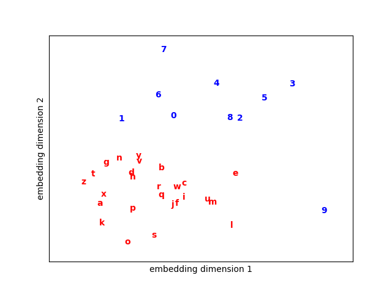

## Word2Vec的COBW实现

### 数据准备

```python
corpus = [
    # number
    "2 4 4 5 6 7 9 0 1 3 7",
    "3 7 8 9 0 3 5 2 5 1 9 7 6",
    "1 1 2 4 6 7 9 8 1 3 5 0 4",
    "3 5 8 9 6 0 2 1 7 4 3 5 8",
    "1 3 5 7 9",
    "2 4 6 8 0",
    "9 9 8 5 1 9 9 9 0 3 3 0",
    "5 5 1 8",
    # alphabets, expecting that 9 is close to letters
    "v d x z z q",
    "g h d j s l q z m w",
    "v n p r l t b x u w a",
    "y z q t w k f h d o b",
    "l k j h 9 9 g f d s 9 a z",
    "q w e r t y u i o 9 p",
    "a s d f g h j k l m 9",
    "m n b v c 9 x z p o i 9",
    "m n b v c x z l k j",
    "x r d k p y a e m q f",
    "a 9 y z s h 9 p k",
]

class Dataset():
    def __init__(self, x, y, v2i, i2v):
        self.x, self.y = x, y
        self.v2i = v2i
        self.i2v = i2v
        self.vocab = v2i.keys()

    def sample(self, n):
        b_idx = np.random.randint(0, len(self.x), size=n)
        bx, by = self.x[b_idx], self.y[b_idx]
        return bx, by

    @property
    def word_nums(self):
        return len(self.v2i)


def process_w2v_data(corpus, skip_window=2):
    all_words = [sentence.split() for sentence in corpus]
    # 一个包含子列表的列表all_words展开为一个一维的NumPy数组
    all_words = np.array(list(itertools.chain(*all_words)))
    # vocab是一个单词列表，v_count是每一个单词对应的数量的列表
    vocab, v_count = np.unique(all_words, return_counts=True)
    # np.argsort 函数返回数组排序后的索引,[::-1]是一个切片操作，表示将数组倒排
    vocab = vocab[np.argsort(v_count)[::-1]]

    v2i = dict(zip(vocab, range(len(vocab))))
    i2v = dict(zip(range(len(vocab)), vocab))

    pairs = []
    js = [idx for idx in range(-skip_window, skip_window + 1) if idx != 0]

    for sentence in corpus:
        words = sentence.split()
        w_idx = [v2i[w] for w in words]
        for i in range(skip_window, len(w_idx) - skip_window):
            context = []
            for j in js:
                # 每个单词对应的上下文所要移动的长度，跳过它本身
                context.append(w_idx[i + j])
            pairs.append(context + [w_idx[i]]) # # 添加当前单词本身作为目标词

    pairs = np.array(pairs)
    x, y = pairs[:, :-1], pairs[:, -1] # 上下文和目标词分离
    return Dataset(x, y, v2i, i2v)

```

### 模型构建

```python
class CBOW(nn.Module):
    def __init__(self, v_dim, emb_dim):
        super().__init__()
        self.v_dim = v_dim
        self.embeddings = nn.Embedding(v_dim, emb_dim)
        # 初始化嵌入层的权重，使其服从均值为0，标准差为0.1的正态分布。
        self.embeddings.weight.data.norm_(0, 0.1)
        # 是一个线性层，将嵌入向量映射回词汇表维度
        self.hidden_out = nn.Linear(emb_dim, v_dim)
        # Adam优化器，用于更新网络的权重，学习率为0.01
        self.opt = torch.optim.Adam(self.parameters(), lr=0.01)

    def forward(self, x):
        x = self.embeddings(x)  # [n, skip_window*2, emb_dim]
        out = torch.mean(x, dim=1)  # [n, emb_dim]
        return out

    def loss(self, x, y, training= True):
        embedded = self(x, training)
        pred = self.hidden_out(embedded)
        return F.cross_entropy(pred, y)

    def step(self, x, y):
        # 将梯度置零，以防止梯度累积
        self.opt.zero_grad()
        # 计算当前批次的损失
        loss = self.loss(x, y)
        # 计算损失相对于网络权重的梯度
        loss.backward()
        # 使用优化器更新网络的权重
        self.opt.step()
        # 返回损失的数值
        return loss.detach().numpy() # detach() 创建一个新的张量，这个张量与原始张量共享相同的数据，但不需要计算梯度，也不参与计算图的构建
```

### 模型训练

```python
def train(model, dataset ):
    if torch.cuda.is_available():
        device = torch.device('cuda')
        model = model.cuda()
    else:
        device = torch.device('cpu')
        model = model.cpu()
    for t in range(5000):
        # 从数据集中随机抽取一个批次的数据
        bx, by = dataset.sample(16)
        bx, by = torch.from_numpy(bx).to(device), torch.from_numpy(by).to(device)
        by = by.long()
        loss = model.step(bx, by)
        if t % 100 == 0:
            print(f"step: {t} | loss: {loss}")
```

### 嵌入向量可视化

```python
def plot_w2v_word_embedding(model, dataset, path):
    word_embedding = model.embeddings.weight.data.cpu().numpy()
    for i in range(dataset.word_nums):
        color = "blue"
        try:
            int(dataset.i2v[i])
        except:
            color = "red"

        plt.text(word_embedding[i, 0], word_embedding[i, 1], s=dataset.i2v[i], color=color, fontweight="bold")

    plt.xlim(word_embedding[:, 0].min(), word_embedding[:,0].max())
    plt.ylim(word_embedding[:, 1].min(), word_embedding[:,1].max())
    plt.xticks()
    plt.yticks()
    plt.xlabel("embedding dimension 1")
    plt.ylabel("embedding dimension 2")
    # plt.savefig('./CBOW.png')
    plt.show()
```

### 运行

```python
import torch
from torch import nn
import torch.nn.functional as F
import numpy as np

import itertools
import matplotlib.pyplot as plt


if __name__ == '__main__':
    dataset = process_w2v_data(corpus, skip_window=2)
    model = CBOW(dataset.word_nums, emb_dim=2)
    train(model, dataset)
    plot_w2v_word_embedding(model,dataset,path="")
```

