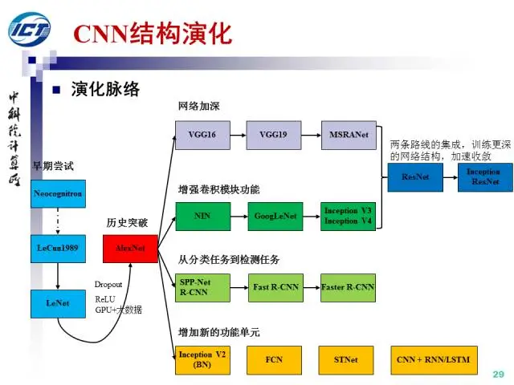

[最全动画诠释各种卷积网络及实现机制](https://blog.csdn.net/qq_41581769/article/details/108871515)

### Batch Normalization

#### 原因

> 如上图所示，当$w_1$发生变化时，loss的变化很小，当$w_2$发生变化是，loss急剧变化，红色曲线为搜索路径

- 通过保持每层输入数据的均值和方差稳定，Batch Normalization有助于避免梯度消失和梯度爆炸问题，使得梯度能够有效地传播到更深的层次。
- 在训练过程中，网络的每一层输入数据的分布会不断变化，这会影响网络的训练速度和稳定性。Batch Normalization通过将每一层的输入数据归一化，减少了这种分布变化，从而加速了训练过程。

#### 类别

#### 流程

1. 计算批量均值和方差

   对于一个mini-batch中的输入数据$x$，计算它们的均值和方差。具体公式如下：
   $$
   \mu_{B}=\frac1m\sum_{i=1}^mx_i\\\sigma_{B}^{2}=\frac1m\sum_{i=1}^m(x_i-\mu_B)^2
   $$
   其中m是mini-batch的大小，$x_i$是第$i$个输入数据。

2. 归一化

   将每个输入数据进行归一化处理，使得它们具有零均值和单位方差：
   $$
   \hat{x}_i=\frac{x_i-\mu_B}{\sqrt{\sigma_B^2+\epsilon}}
   $$
   其中$\epsilon$表示一个小常数，防止除零错误。

3. 缩放和平移

   引入两个可训练参数，缩放参数$\gamma$和平移参数$\beta$，对归一化后的数据进行缩放和平移：
   $$
   y_i=\gamma x_i + \beta
   $$
   这一步的目的是保留网络对表示能力的控制，使得即使在归一化后，网络仍然能够表达复杂的函数。

### CNN演化

> 图片取自刘昕博士，原文[卷积神经网络的发展历程](https://blog.csdn.net/qq_36167072/article/details/96155670)

