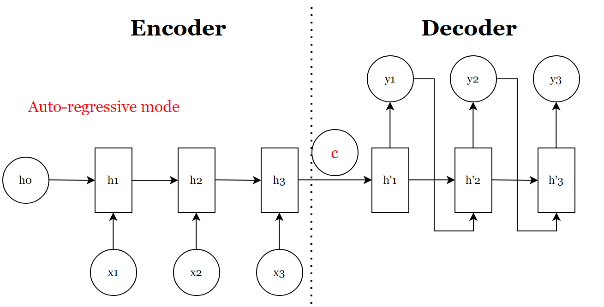
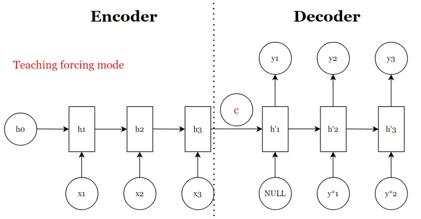
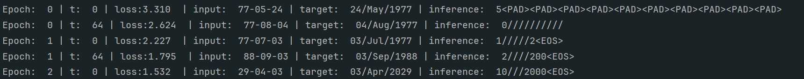
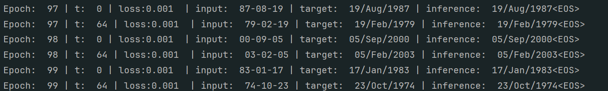
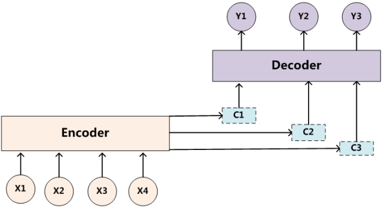
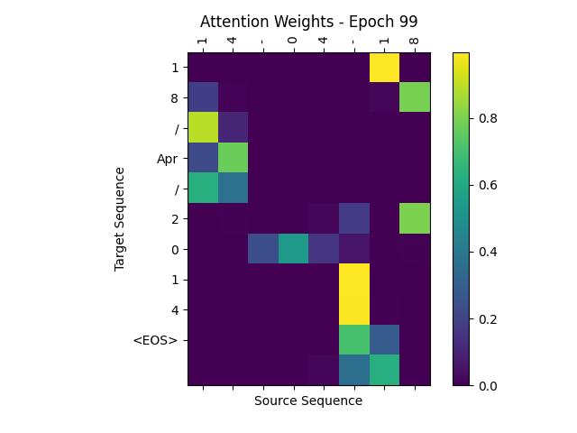

## Seq2Seq的原理

Seq2Seq（Sequence-to-Sequence）模型是一种用于处理序列到序列任务的神经网络模型。它在许多自然语言处理（NLP）任务中都得到了广泛的应用，包括机器翻译、文本摘要、对话生成等。

### 模型概述

Seq2Seq 模型的目标是将一个序列转换为另一个序列。具体来说，给定一个输入序列 $X = (x_1, x_2, \ldots, x_T)$，模型的任务是生成一个输出序列 $Y = (y_1, y_2, \ldots, y_U)$​。

### 模型架构



#### Encoder

负责将输入序列压缩成一个固定长度的向量，这个向量可以看作是对输入序列的语义表示。这个过程被称为**编码**。如上图所示，获取语义向量的最简单方法是直接使用最后一个时间步的隐藏状态作为这个语义向量 $C$。此外，也可以对最后一个隐藏状态进行进一步的变换，以得到语义向量。

- **编码过程**： 在编码过程中，我们将输入序列$X = (x_1, x_2, \ldots, x_T)$通过编码器转换为一个固定长度的向量 $C$，这个向量可以看作是对整个输入序列的语义信息的压缩表示。编码的目标是将输入序列的所有信息浓缩到一个较小的向量中，这个向量包含了对整个输入序列的整体理解。
- **直接使用最后一个隐藏状态**： 最简单的方式是直接将编码器在最后一个时间步的隐藏状态作为语义向量 $C$。这种方法利用了 RNN、LSTM 或 GRU 等模型在处理序列数据时，最终时间步的隐藏状态能够捕捉到序列的整体信息。可以表示为：

$$
C = h_T
$$

​	其中$h_T$ 是在时间步 $T$ 的隐藏状态。

- **对最后一个隐藏状态进行变换**： 另一种方法是对最后一个隐藏状态进行进一步的变换，以获得语义向量 $C$。这种方法通常包括对隐藏状态进行线性变换或应用非线性激活函数。可以表示为：

$$
C = W_h \cdot h_T + b_h
$$

​	其中$W_h$ 是权重矩阵，$b_h$ 是偏置项。通过这种方式，编码器的最终隐藏$h_T$状态被映射到一个新的空间，以适应后续任务的需求。

#### Decoder

根据语义向量生成指定的序列，这个过程也称为解码，如上图所示，最简单的方式是将Encoder得到的语义向量作为初始状态输出到Decoder的RNN中，得到输出序列。可以看到上一时刻的输出会作为当前时刻的输入，而且其中的语义向量C只作为初始状态参与运算，后面的运算都与C没有关系。

- **解码过程**：目标是从编码器生成的语义向量中生成一个目标序列 Y=(y1,y2,…,yU)Y = (y_1, y_2, \ldots, y_U)Y=(y1,y2,…,yU)。在这个过程中，解码器将语义向量 $C$ 作为起始点，逐步生成输出序列的每一个词或符号。

- **将语义向量作为初始状态**：在解码的最简单形式中，编码器生成的语义向量 $C$ 被用作解码器 RNN 的初始状态。这个语义向量包含了对整个输入序列的语义信息，并作为解码器生成目标序列的起点。具体来说，语义向量 $C$​ 被用来初始化解码器的隐藏状态和细胞状态：
  $$
  (h_0, c_0) = (h_T, c_T)
  $$
  

  其中 $h_T$ 和 $c_T$ 分别是编码器最后一个时间步的隐藏状态和细胞状态。

- **逐步生成输出序列**：解码器在每一个时间步生成一个词，并将生成的词作为下一时间步的输入。在解码过程中，上一时刻的输出 $y_{t-1}$ 被作为当前时刻的输入，模型通过一个 RNN（如 LSTM 或 GRU）逐步生成整个目标序列。这一过程可以表示为：
  $$
  y_t = \text{Decoder}(y_{t-1}, (h_{t-1}, c_{t-1}))
  $$
  

  其中$y_{t-1}$ 是前一个时间步生成的词，$(h_{t-1}, c_{t-1})$是前一个时间步的隐藏状态和细胞状态。

### 基于LSTM的Seq2Seq实战

> 目标是将中文格式为%y-%m-%d的时间字符串转换为英文格式为 %d/%b/%Y的时间字符串

#### 自定义数据集

```python
PAD_ID = 0
# 自定义数据集，继承自torch.utils.data.Dataset
class DateDataset(Dataset):
    def __init__(self, n):
        np.random.seed(213)
        # 语料， 生成 n 个随机日期，并将其转换为日期字符串， 中文格式为 %y-%m-%d，英文格式为 %d/%b/%Y
        self.date_cn = []
        self.date_en = []
        for timestamp in np.random.randint(143835585, 2043835585, n):
            date = datetime.datetime.fromtimestamp(timestamp)
            self.date_cn.append(date.strftime("%y-%m-%d"))
            self.date_en.append(date.strftime("%d/%b/%Y"))
        # 词表
        self.vocab = set(
            [str(i) for i in range(0, 10)] + ["-", "/", "<GO>", "<EOS>"] + [i.split("/")[1] for i in self.date_en]
        )
        self.v2i = dict(zip(self.vocab, range(1, len(self.vocab) + 1))) # 创建词汇到索引的映射
        self.v2i["<PAD>"] = PAD_ID  # 为 <PAD> 标记分配一个特殊的索引 PAD_ID
        self.vocab.add("<PAD>")

        self.i2v = {i: v for v, i in self.v2i.items()}  # 创建索引到词汇的映射
        # 生成训练数据
        self.x, self.y = [], []
        for cn, en in zip(self.date_cn, self.date_en):  # 将日期字符串转换为索引序列
            self.x.append([self.v2i[v] for v in cn])
            self.y.append([self.v2i["<GO>"],] + [self.v2i[v] for v in en[:3]] + [self.v2i[en[3:6]]] + [self.v2i[v] for v in en[6:]] + [self.v2i["<EOS>"],])
        self.x, self.y = np.array(self.x), np.array(self.y)  # 将x和y转化为索引数组 x shape[n, 10] y shape [n, 11]
        self.start_token = self.v2i["<GO>"]
        self.end_token = self.v2i["<EOS>"]

    def __len__(self):
        return len(self.x)

    @property  # 词汇表大小
    def words_num(self):
        return len(self.vocab)

    # 获取单个数据样本
    def __getitem__(self, idx):
        return self.x[idx], self.y[idx], len(self.y[idx]) - 1

    # 将索引序列转换为字符串
    def idx2str(self, idxs):
        x = []
        for i in idxs:
            x.append(self.i2v[i])
            if i == self.end_token:
                break
        return "".join(x)
```

#### Seq2Seq模型构建

首先需要构建一个**编码器**（encoder），它的作用是将原始的词向量按顺序组合成一个**句向量**。这个句向量可以被视为对整个输入序列的语义压缩表示，是进行解码（decode）工作的基础。

解码器在训练阶段与在实际应用中的推理阶段（inference）是有所不同的。这两种阶段分别使用了不同的策略来实现目标序列的生成。在训练阶段，解码器通常使用**教师强制**（Teacher Forcing）技术：



- **教师强制**： 在训练时，我们将真实的目标序列标签作为解码器每一步的输入，而不是模型预测的结果。这种做法可以显著降低训练的难度，尤其是在训练开始时。具体来说，即使模型在某一步的预测是错误的，下一步的输入仍然是正确的标签。这使得训练过程能够更快地收敛，因为解码器在每一步都可以得到正确的输入，从而更有效地进行参数更新。

在推理阶段，解码器则需要基于自身生成的输出进行下一步的预测：

- **自回归生成**： 在实际应用中，我们需要使用模型生成的预测结果作为下一步的输入，这种方法被称为自回归生成（Autoregressive Generation）。在这种情况下，我们没有真实的标签来参考，因此每一步的预测都依赖于前一步的输出。

```python
class Seq2Seq(nn.Module):
    def __init__(self, encoder_embeddings_num, decoder_embeddings_num, embedding_dim, units, max_pred_len, start_token, end_token):
        """

        :param encoder_embeddings_num: 词汇表的大小，也是嵌入向量的数量
        :param decoder_embeddings_num: 词汇表的大小
        :param embedding_dim: 嵌入向量的维度
        :param units: 隐藏单元的维度
        :param max_pred_len: 最大预测长度
        :param start_token: 解码器开始标记的索引
        :param end_token: 解码器结束标记的索引
        """
        super(Seq2Seq, self).__init__()
        self.units = units  # hidden_stat的维度
        self.decoder_embeddings_num = decoder_embeddings_num

        # encoder
        self.encoder_embeddings = nn.Embedding(encoder_embeddings_num, embedding_dim)
        nn.init.normal_(self.encoder_embeddings.weight, std=0.1, mean=0.0)
        self.encoder = nn.LSTM(embedding_dim, units, batch_first=True)

        # decoder
        self.decoder_embeddings = nn.Embedding(decoder_embeddings_num, embedding_dim)
        nn.init.normal_(self.decoder_embeddings.weight, std=0.1, mean=0.0)
        self.decoder_cell = nn.LSTMCell(embedding_dim, units)
        self.decoder_dense = nn.Linear(units, decoder_embeddings_num)

        self.start_token = start_token
        self.end_token = end_token
        self.max_pred_len = max_pred_len
        self.optimizer = optim.Adam(self.parameters(), lr=0.001)

    def encode(self, x):
        # 将序列x转化为嵌入向量， 然后通过LSTM编码， 隐藏状态H和细胞状态C
        embedded = self.encoder_embeddings(x)
        # H [1, batch_size, hidden_dim]
        # C [1, batch_size, hidden_dim]
        hidden = (torch.zeros(1, x.shape[0], self.units), torch.zeros(1, x.shape[0], self.units))
        o, (h, c) = self.encoder(embedded, hidden)
        return h, c

    def train_logits(self, x, y):
        # 编码输入序列 x，得到编码后的隐藏状态 hx 和细胞状态 cx
        hx, cx = self.encode(x)
        # 将 hx 和 cx 从形状 (1, batch_size, hidden_units) 转换为 (batch_size, hidden_units)
        hx, cx = hx[0], cx[0]
        # 将目标序列 y 的所有时间步（除了最后一个时间步）作为解码器的输入
        dec_in = y[:, :-1]
        # 将解码器输入序列转换为嵌入表示
        dec_emb_in = self.decoder_embeddings(dec_in)
        # 调整嵌入表示的维度顺序，从 (batch_size, seq_len, embedding_dim) 转换为 (seq_len, batch_size, embedding_dim)
        dec_emb_in = dec_emb_in.permute(1, 0, 2)
        # 初始化一个空列表，用于存储解码器的输出
        output = []
        # 遍历每一个时间步的嵌入表示
        for i in range(dec_emb_in.shape[0]):
            # 对于当前时间步 i，更新解码器的隐藏状态和细胞状态
            hx, cx = self.decoder_cell(dec_emb_in[i], (hx, cx))
            # 将隐藏状态 hx 通过全连接层转换为词汇表大小的向量，得到当前时间步的输出
            out = self.decoder_dense(hx)
            # 将当前时间步的输出添加到输出列表中
            output.append(out)
        # 将所有时间步的输出堆叠成一个张量，维度为(seq_len, batch_size, decoder_embeddings_num)
        output = torch.stack(output, dim=0)
        return output.permute(1, 0, 2)

    def step(self, x, y):
        # 第一步：清零梯度，在每一个更新参数之前，将优化器的梯度缓冲区清零
        self.optimizer.zero_grad()

        # 第二步，计算logits, 调用train_logits，对输入序列 x 进行编码和解码， 计算得到logits，即模型在每个时间步上预测的输出值。
        logits = self.train_logits(x, y)
        # 取目标序列 y 的后 n-1 个时间步作为解码器的真实输出
        dec_out = y[:, 1:]
        dec_out = dec_out.long()
        # 第四步，计算交叉熵损失
        # logits.reshape(-1, self.decoder_embeddings_num) 将 logits 重新调整为 (batch_size * seq_len, decoder_embeddings_num) 的形状
        # dec_out.reshape(-1) 将解码器的真实输出 dec_out 调整为 (batch_size * seq_len) 的形状 ，这样可以使得 logits 和 dec_out 在形状上匹配，从而计算每个时间步的交叉熵损失
        loss = F.cross_entropy(logits.reshape(-1, self.decoder_embeddings_num), dec_out.reshape(-1))
        # 第五步： 反向传播
        loss.backward()
        # 第六步： 更新参数
        self.optimizer.step()
        # 返回损失值
        return loss.detach().numpy()

    def inference(self, x):
        # 设置模型为评估模式
        self.eval()
        # 输入编码序列得到隐藏状态 hx 和 cx , 并调整他们的形状为 [batch_size, hidden_dim]
        hx, cx = self.encode(x)
        hx, cx = hx[0], cx[0]
        # 初始化解码器的输入，
        start = torch.ones(x.shape[0], 1)
        start[:, 0] = torch.tensor(self.start_token)
        start = start.long()

        # 将起始输入转化为嵌入向量
        dec_emb_in = self.decoder_embeddings(start)
        # 将解码器输入的形状变为 [1, bat_size, embedding_dim]
        dec_emb_in = dec_emb_in.permute(1, 0, 2)
        # 取第一个时间步的嵌入表示 dec_in
        dec_in = dec_emb_in[0]
        # 初始化一个空列表，用于存储解码器的输出
        output = []
        # 解码过程
        for i in range(self.max_pred_len):
            hx, cx = self.decoder_cell(dec_in, (hx, cx))
            # out的形状 [batch_size, decoder_embeddings_num]
            out = self.decoder_dense(hx)
            # 使用 argmax 从输出中选择概率最高的索引，作为下一个时间步的输入
            out = out.argmax(dim=1).view(-1, 1)
            # 将当前时间步的输出嵌入表示 dec_in 更新为下一个时间步的输入，并将输出添加到输出列表中
            dec_in = self.decoder_embeddings(out).permute(1, 0, 2)[0]
            output.append(out)
        # 将所有时间步的输出堆叠成一个张量，形状为 (max_pred_len, batch_size, 1)
        output = torch.stack(output, dim=0)
        # 恢复模型为训练模式
        self.train()

        return output.permute(1, 0, 2).view(-1, self.max_pred_len)
```

#### 训练过程

```python
def train(dataset):
    loader = DataLoader(dataset, batch_size=32, shuffle=True)
    model = Seq2Seq(dataset.words_num, dataset.words_num, embedding_dim=16, units=32, max_pred_len=11, start_token=dataset.start_token, end_token=dataset.end_token)
    for epoch in range(100):
        for idx, batch in enumerate(loader):
            x, y, decoder_len = batch
            loss = model.step(x, y)
            if idx % 64 == 0:
                target = dataset.idx2str(y[0, 1: -1].data.numpy())
                pred = model.inference(x[0:1])
                res = dataset.idx2str(pred[0].data.numpy())
                src = dataset.idx2str(x[0].data.numpy())
                print("Epoch: ", epoch, "| t: ", idx, "| loss:%.3f " % loss, "| input: ", src, "| target: ", target, "| inference: ", res)
```

#### 实验结果





### 编码器-解码器（Encoder-Decoder）注意力机制

上面的例子中，Encoder和Decoder中唯一联系就是一个固定长度的语义向量C，即Encoder要将整个序列的信息压缩进一个固定产固定的向量中，那么之前输入内容带有的信息就会被后如如的内容稀释掉，输入序列越长，这个现象就越严重。在更先进的 Seq2Seq 模型中（例如 Transformer 和 Attention-based Seq2Seq），注意力机制（Attention Mechanism）用于改进 Seq2Seq 结构。注意力机制允许解码器在每个时间步查看输入序列的不同部分，从而能够对不同输入部分分配不同的权重。



#### **计算注意力权重**

- 对编码器的所有隐藏状态进行加权，以生成对其向量

- 计算注意力权重$\alpha$：
  $$
  \alpha_{t,j}=\frac{\exp(e_{t,j})}{\sum_{k=1}^T\exp(e_{t,k})}
  $$

- 注意力得分 $e_{t, j}$ 可以使用多种方式计算，例如：
  $$
  e_{t,j}=score(h_j,s_{t−1})
  $$
  其中，$s_{t-1}$ 是解码器在时间步$t-1$的隐藏状态

#### 生成上下文向量

上下文向量 $c_t$​ 是加权后的隐藏状态：
$$
c_t = \sum_{j=1}^T\alpha_{t,j}h_j
$$


#### 将上下文向量输入到解码器

将上下文向量 $c_t$​ 作为解码器的输入之一，用于生成下一个时间步的词

#### 分解步骤

1. 对Encoder的所有隐藏状态计算Score
2. 将Score放到Softmax层计算，得到Attention Distribution
3. 将每个编码器隐藏状态乘以其Softmaxed的权重
4. 对向量求和，对齐向量相加产生上下文向量

#### 完整代码如下

```python
import torch
from torch import nn, optim
import numpy as np
import torch.nn.functional as F
from torch.utils.data import Dataset, DataLoader
import datetime

PAD_ID = 0
# 自定义数据集，继承自torch.utils.data.Dataset
class DateDataset(Dataset):
    def __init__(self, n):
        np.random.seed(213)
        # 语料， 生成 n 个随机日期，并将其转换为日期字符串， 中文格式为 %y-%m-%d，英文格式为 %d/%b/%Y
        self.date_cn = []
        self.date_en = []
        for timestamp in np.random.randint(143835585, 2043835585, n):
            date = datetime.datetime.fromtimestamp(timestamp)
            self.date_cn.append(date.strftime("%y-%m-%d"))
            self.date_en.append(date.strftime("%d/%b/%Y"))

        # 词表
        self.vocab = set(
            [str(i) for i in range(0, 10)] + ["-", "/", "<GO>", "<EOS>"] + [i.split("/")[1] for i in self.date_en]
        )
        self.v2i = dict(zip(self.vocab, range(1, len(self.vocab) + 1))) # 创建词汇到索引的映射
        self.v2i["<PAD>"] = PAD_ID  # 为 <PAD> 标记分配一个特殊的索引 PAD_ID
        self.vocab.add("<PAD>")

        self.i2v = {i: v for v, i in self.v2i.items()}  # 创建索引到词汇的映射
        # 生成训练数据
        self.x, self.y = [], []
        for cn, en in zip(self.date_cn, self.date_en):  # 将日期字符串转换为索引序列
            self.x.append([self.v2i[v] for v in cn])
            self.y.append([self.v2i["<GO>"],] + [self.v2i[v] for v in en[:3]] + [self.v2i[en[3:6]]] + [self.v2i[v] for v in en[6:]] + [self.v2i["<EOS>"],])
        self.x, self.y = np.array(self.x), np.array(self.y)  # 将x和y转化为索引数组 x shape[n, 10] y shape [n, 11]
        self.start_token = self.v2i["<GO>"]
        self.end_token = self.v2i["<EOS>"]

    def __len__(self):
        return len(self.x)

    @property  # 词汇表大小
    def words_num(self):
        return len(self.vocab)

    # 获取单个数据样本
    def __getitem__(self, idx):
        return self.x[idx], self.y[idx], len(self.y[idx]) - 1

    # 将索引序列转换为字符串
    def idx2str(self, idxs):
        x = []
        for i in idxs:
            if i == self.end_token:
                break
            x.append(self.i2v[i])

        return "".join(x)


# Step 2: 实现Seq2Seq
class Seq2Seq(nn.Module):
    def __init__(self, encoder_embeddings_num, decoder_embeddings_num, embedding_dim, units, max_pred_len, start_token, end_token):
        """

        :param encoder_embeddings_num: 词汇表的大小，也是嵌入向量的数量
        :param decoder_embeddings_num: 词汇表的大小
        :param embedding_dim: 嵌入向量的维度
        :param units: 隐藏单元的维度
        :param max_pred_len: 最大预测长度
        :param start_token: 解码器开始标记的索引
        :param end_token: 解码器结束标记的索引
        """
        super(Seq2Seq, self).__init__()
        self.units = units  # hidden_stat的维度
        self.decoder_embeddings_num = decoder_embeddings_num

        # encoder
        self.encoder_embeddings = nn.Embedding(encoder_embeddings_num, embedding_dim)
        nn.init.normal_(self.encoder_embeddings.weight, std=0.1, mean=0.0)
        self.encoder = nn.LSTM(embedding_dim, units, batch_first=True)

        # decoder
        self.decoder_embeddings = nn.Embedding(decoder_embeddings_num, embedding_dim)
        nn.init.normal_(self.decoder_embeddings.weight, std=0.1, mean=0.0)
        self.decoder_cell = nn.LSTMCell(embedding_dim, units)
        self.decoder_dense = nn.Linear(2 * units, decoder_embeddings_num)

        # attention
        self.attention = nn.Linear(units, units)

        self.start_token = start_token
        self.end_token = end_token
        self.max_pred_len = max_pred_len
        self.optimizer = optim.Adam(self.parameters(), lr=0.001)

    def encode(self, x):
        # 将序列x转化为嵌入向量， 然后通过LSTM编码， 隐藏状态H和细胞状态C
        embedded = self.encoder_embeddings(x)
        # H [1, seq_len, hidden_dim]
        # C [1, seq_len, hidden_dim]
        hidden = (torch.zeros(1, x.shape[0], self.units), torch.zeros(1, x.shape[0], self.units))
        # o [batch_size, seq_len, hidden_dim]
        # h [num_layers * num_directions, batch_size, hidden_dim]
        # c [num_layers * num_directions, batch_size, hidden_dim]
        o, (h, c) = self.encoder(embedded, hidden)
        return o, h, c

    def train_logits(self, x, y):
        # 编码输入序列 x，得到编码后的隐藏状态 hx 和细胞状态 cx
        o, hx, cx = self.encode(x)
        # 将 hx 和 cx 从形状 (1, batch_size, hidden_units) 转换为 (batch_size, hidden_units)
        hx, cx = hx[0], cx[0]
        # 将目标序列 y 的所有时间步（除了最后一个时间步）作为解码器的输入
        dec_in = y[:, :-1]
        # 将解码器输入序列转换为嵌入表示
        dec_emb_in = self.decoder_embeddings(dec_in)
        # 调整嵌入表示的维度顺序，从 (batch_size, seq_len, embedding_dim) 转换为 (seq_len, batch_size, embedding_dim)
        dec_emb_in = dec_emb_in.permute(1, 0, 2)
        # 初始化一个空列表，用于存储解码器的输出
        output = []
        # 遍历每一个时间步的嵌入表示
        for i in range(dec_emb_in.shape[0]):
            # 将编码器输出（经过线性变换）与解码器隐藏状态相乘，得到注意力分数 attn_prob
            # [batch_size, seq_len, 1] = [batch_size, seq_len, hidden_dim] matmul [batch_size, hidden_dim, 1]
            attn_prob = torch.matmul(self.attention(o), hx.unsqueeze(2))
            # 计算注意力权重 [batch_size, seq_len, 1]
            attn_weight = F.softmax(attn_prob, dim=1)
            # 计算上下文向量 [batch_size,hidden_dim, seq_len ] matmul [batch_size, seq_len, 1]
            context = torch.matmul(o.permute(0, 2, 1), attn_weight)
            # 对于当前时间步 i，更新解码器的隐藏状态和细胞状态
            hx, cx = self.decoder_cell(dec_emb_in[i], (hx, cx))
            # 连接上下文向量和解码器隐藏状态 [batch_size, hidden_dim * 2]
            hc = torch.cat([context.squeeze(2), hx], dim=1)
            # 将隐藏状态 hx 通过全连接层转换为词汇表大小的向量，得到当前时间步的输出
            out = self.decoder_dense(hc)
            # 将当前时间步的输出添加到输出列表中
            output.append(out)
        # 将所有时间步的输出堆叠成一个张量，维度为(seq_len, batch_size, decoder_embeddings_num)
        output = torch.stack(output, dim=0)
        return output.permute(1, 0, 2)

    def step(self, x, y):
        # 第一步：清零梯度，在每一个更新参数之前，将优化器的梯度缓冲区清零
        self.optimizer.zero_grad()

        # 第二步，计算logits, 调用train_logits，对输入序列 x 进行编码和解码， 计算得到logits，即模型在每个时间步上预测的输出值。
        logits = self.train_logits(x, y)
        # 取目标序列 y 的后 n-1 个时间步作为解码器的真实输出
        dec_out = y[:, 1:]
        dec_out = dec_out.long()
        # 第四步，计算交叉熵损失
        # logits.reshape(-1, self.decoder_embeddings_num) 将 logits 重新调整为 (batch_size * seq_len, decoder_embeddings_num) 的形状
        # dec_out.reshape(-1) 将解码器的真实输出 dec_out 调整为 (batch_size * seq_len) 的形状 ，这样可以使得 logits 和 dec_out 在形状上匹配，从而计算每个时间步的交叉熵损失
        loss = F.cross_entropy(logits.reshape(-1, self.decoder_embeddings_num), dec_out.reshape(-1))
        # 第五步： 反向传播
        loss.backward()
        # 第六步： 更新参数
        self.optimizer.step()
        # 返回损失值
        return loss.detach().numpy()

    def inference(self, x):
        # 设置模型为评估模式
        self.eval()
        # 输入编码序列得到隐藏状态 hx 和 cx , 并调整他们的形状为 [batch_size, hidden_dim]
        o, hx, cx = self.encode(x)
        hx, cx = hx[0], cx[0]
        # 初始化解码器的输入，
        start = torch.ones(x.shape[0], 1)
        start[:, 0] = torch.tensor(self.start_token)
        start = start.long()

        # 将起始输入转化为嵌入向量
        dec_emb_in = self.decoder_embeddings(start)
        # 将解码器输入的形状变为 [1, bat_size, embedding_dim]
        dec_emb_in = dec_emb_in.permute(1, 0, 2)
        # 取第一个时间步的嵌入表示 dec_in
        dec_in = dec_emb_in[0]
        # 初始化一个空列表，用于存储解码器的输出
        output = []
        # 解码过程
        for i in range(self.max_pred_len):
            attn_prob = torch.matmul(self.attention(o), hx.unsqueeze(2))
            attn_weight = F.softmax(attn_prob, dim=1)
            context = torch.matmul(o.permute(0, 2, 1), attn_weight)
            hx, cx = self.decoder_cell(dec_in, (hx, cx))
            hc = torch.cat([context.squeeze(2), hx], dim=1)
            # out的形状 [batch_size, decoder_embeddings_num]
            out = self.decoder_dense(hc)
            # 使用 argmax 从输出中选择概率最高的索引，作为下一个时间步的输入
            out = out.argmax(dim=1).view(-1, 1)
            # 将当前时间步的输出嵌入表示 dec_in 更新为下一个时间步的输入，并将输出添加到输出列表中
            dec_in = self.decoder_embeddings(out).permute(1, 0, 2)[0]
            output.append(out)
        # 将所有时间步的输出堆叠成一个张量，形状为 (max_pred_len, batch_size, 1)
        output = torch.stack(output, dim=0)
        # 恢复模型为训练模式
        self.train()

        return output.permute(1, 0, 2).view(-1, self.max_pred_len)


def train(dataset):
    loader = DataLoader(dataset, batch_size=32, shuffle=True)
    model = Seq2Seq(dataset.words_num, dataset.words_num, embedding_dim=16, units=32, max_pred_len=11, start_token=dataset.start_token, end_token=dataset.end_token)
    for epoch in range(100):
        for idx, batch in enumerate(loader):
            x, y, decoder_len = batch
            loss = model.step(x, y)
            if idx % 64 == 0:
                target = dataset.idx2str(y[0, 1: -1].data.numpy())
                pred = model.inference(x[0:1])
                res = dataset.idx2str(pred[0].data.numpy())
                src = dataset.idx2str(x[0].data.numpy())
                print("Epoch: ", epoch, "| t: ", idx, "| loss:%.3f " % loss, "| input: ", src, "| target: ", target, "| inference: ", res)


if __name__ == '__main__':
    data = DateDataset(4000)
    train(data)
```



## 参考资料

https://blog.csdn.net/djfjkj52/article/details/130388032