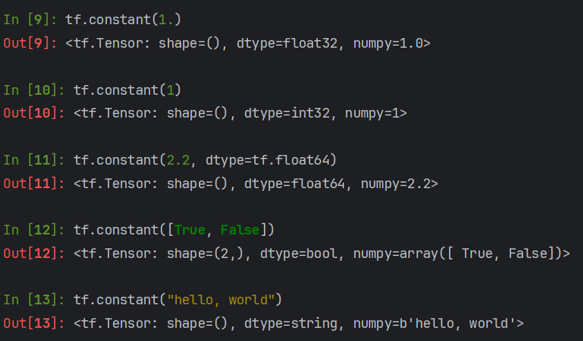
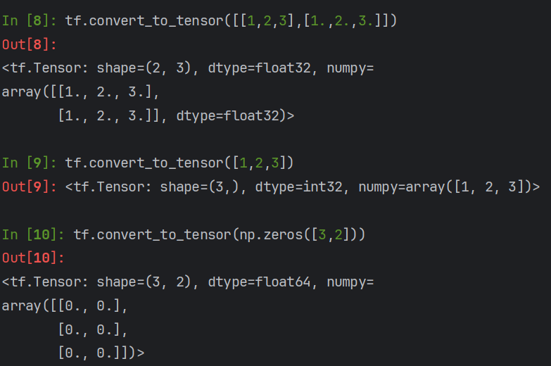

#### 基础类型

Python 列表的元素可以是任何类型，因此它们是动态类型的。每个元素存储时需要额外的元数据，导致内存使用效率较低。另外列表在执行数值计算时效率较低，因为它们不支持矢量化操作，每个元素需要单独处理。

Numpy 不支持自动微分（automatic differentiation），这对机器学习和深度学习中的反向传播算法很重要。虽然有些库（如 CuPy）提供了类似于 Numpy 的 GPU 支持，但 Numpy 自身并不原生支持 GPU 加速。

Tensor 是一种在深度学习框架（如 TensorFlow 和 PyTorch）中广泛使用的数据结构，它们设计用于高效的数值计算和自动微分。

- Tensor 支持自动微分，这对于训练神经网络非常重要。它允许我们自动计算梯度，从而方便地进行优化。
- Tensor 支持高效的矢量化操作和广播机制，能够在 CPU 和 GPU 上高效运行。
- Tensor 是多维数组，设计上与 Numpy 数组类似，但具有更强的功能和更高的性能。
- Tensor 通常能够在多种硬件上高效运行，包括 CPU、GPU，甚至 TPU（Tensor Processing Units）。

##### Tensor是什么

Tensor 是一种通用的数据结构，可以看作是一个多维数组。标量（0维）、向量（1维）、矩阵（2维）都是特殊类型的 Tensor。

- 标量：0维 Tensor，如 `5`。
- 向量：1维 Tensor，如 `[1, 2, 3]`。
- 矩阵：2维 Tensor，如 `[[1, 2], [3, 4]]`。
- 高维 Tensor：可以有更多维度，如 `3D Tensor` 或 `4D Tensor`。

##### 创建Tensor

> TensorFlow支持int float double bool 和 string类型

##### Tensor的属性

##### Tensor类型检查

##### 类型转换

##### tf.Variable

> 相当于在tensor的基础上包了一层，这样一来，计算图就知道在训练时哪些变量应该被求导和反向传播

#### 创建Tensor

- `from numpy, list`

- `ones, zeros`

  

- `fill`

  

- `random`

  

- `constant`

  

  

  

