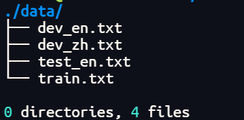

### 相关工具

1. Linux操作系统、Python3、Pip

   `sudo apt install pip3`

2. [Moses](https://github.com/moses-smt/mosesdecoder) (一个SMT工具，在这里只会用到一些预处理脚本，如：**tokenisation**, **truecasing**, **cleaning**), 这是[文档](http://www.statmt.org/moses/?n=Moses.Baseline)，安装指令如下：

   `git clone https://github.com/moses-smt/mosesdecoder.git`

3. [subword-nmt](https://github.com/rsennrich/subword-nmt) (使用BPE算法生成子词的预处理脚本)，安装指令如下：

   `git clone https://github.com/rsennrich/subword-nmt.git`

4. [jieba](https://github.com/fxsjy/jieba) (中文分词组件)，安装指令如下:

   `pip install jieba`

### 处理流程

#### 目录结构


#### DATA目录内部



#### 切分

> train.txt数据格式为`en\tzh`，因故需要切分

```bash
cut -f 1 ./data/train.txt > ./data/raw.en | cut -f 2 ./data/train.txt > ./data/raw.zh
```

### normalize-punctuation

> 标点符号的标准化，同时对双语文件(raw.en, raw.zh)处理，使用命令

```bash
perl ./mosesdecoder/scripts/tokenizer/normalize-punctuation.perl -l en < ./data/raw.en > ./data/norm.en
perl ./mosesdecoder/scripts/tokenizer/normalize-punctuation.perl -l zh < ./data/raw.zh > ./data/norm.zh
```

#### 中文分词

对标点符号标准化后的中文文件(norm.zh)进行分词处理，使用命令：

```bash
python3 -m jieba -d " " ./data/norm.zh > ./data/norm.seg.zh
```

处理完成后：

```bash
# norm.zh
史蒂芬·帕伦：追寻水银的踪迹
海洋是一个非常复杂的事物。
人类的健康也是一件非常复杂的事情。
# norm.seg.zh
史蒂芬 · 帕伦 ： 追寻 水银 的 踪迹
海洋 是 一个 非常复杂 的 事物 。
人类 的 健康 也 是 一件 非常复杂 的 事情 。
```

#### Tokenize

对上述处理后的双语文件(norm.en, norm.seg.zh)进行标记化处理，有很多功能(1.将**英文单词**与**标点符号**用空格分开 2.将多个连续空格简化为一个空格 3.将很多符号替换成转义字符，如：把`"`替换成`&quot`、把`can't`替换成`can &apos;t`)，使用命令：

```bash
./mosesdecoder/scripts/tokenizer/tokenizer.perl -l en  < ./data/norm.en > ./data/norm.tok.en
./mosesdecoder/scripts/tokenizer/tokenizer.perl -l zh  < ./data/norm.seg.zh > ./data/norm.seg.tok.zh
```

处理完成后：

```bahs
# norm.tok.en
And those simple themes aren &apos;t really themes about the complex science of what &apos;s going on , but things that we all pretty well know . And I &apos;m going to start with this one : If momma ain &apos;t happy , ain &apos;t nobody happy .

# norm.seg.tok.zh
我们 也 可能 会 让 海洋 里 的 细菌 ， 和 病毒 大量 繁殖 。
这里 的 两张 照片 都 是 红潮 的 这 里面 有 一种 弧菌 ， 带有 霍乱 细菌 。
有 多少 人见 过 &quot; 海岸 禁入 &quot; 的 标志 呢 ？
为什么 会 这样 呢 ？
```

#### truecase

对上述处理后的英文文件(norm.tok.en)进行大小写转换处理(对于句中的每个英文单词，尤其是**句首单词**，在数据中**学习**最适合它们的大小写形式)，使用命令：

```bash
./mosesdecoder/scripts/recaser/train-truecaser.perl --model ./model/truecase-model.en --corpus ./data/norm.tok.en
./mosesdecoder/scripts/recaser/truecase.perl --model ./model/truecase-model.en < ./data/norm.tok.en > ./data/norm.tok.true.en
```

#### bpe

对上述处理后的双语文件(norm.tok.true.en, norm.seg.tok.zh)进行子词处理(可以理解为更细粒度的分词)，使用命令：

```bash
# 都是在训练集上运行
python3 ./subword-nmt/subword_nmt/learn_joint_bpe_and_vocab.py --input ./data/norm.tok.true.en -s 35000 -o ./model/bpecode.en --write-vocabulary ./model/voc.en

python3 ./subword-nmt/subword_nmt/apply_bpe.py -c ./model/bpecode.en --vocabulary ./model/voc.en < ./data/norm.tok.true.en > ./data/norm.tok.true.bpe.en

python3 ./subword-nmt/subword_nmt/learn_joint_bpe_and_vocab.py --input ./data/norm.seg.tok.zh -s 65000 -o ./model/bpecode.zh --write-vocabulary ./model/voc.zh

python3 ./subword-nmt/subword_nmt/apply_bpe.py -c ./model/bpecode.zh --vocabulary ./model/voc.zh < ./data/norm.seg.tok.zh > ./data/norm.seg.tok.bpe.zh
```

### clean

对上述处理后的双语文件(norm.tok.true.bpe.en, norm.seg.tok.bpe.zh)进行过滤(可以过滤**最小长度**和**最大长度**之间的句对，这样能够有效过滤空白行。还可以过滤**长度比**不合理的句对)，使用命令：

```bash
mv ./data/norm.seg.tok.bpe.zh ./data/toclean.zh
mv ./data/norm.tok.true.bpe.en ./data/toclean.en
./mosesdecoder/scripts/training/clean-corpus-n.perl ./data/toclean zh en ./data/clean 1 256
```


